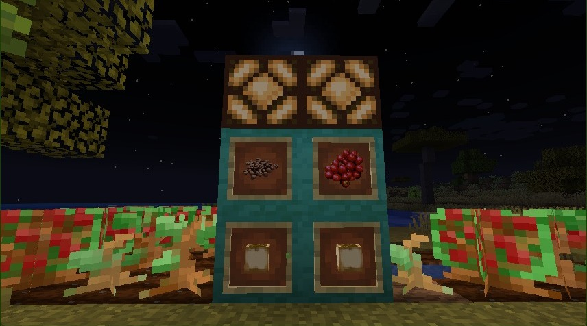

<h1>MCoffee — You Want a Cup?</h1>

<h2>
So addicted to coffee that I added it into Minecraft — now I can sip in-game while sipping IRL ☕
</h2>

<b>MCoffee</b> adds a fully immersive coffee system into Minecraft, from seed to cup. Grow it, roast it, brew it — just don’t overdo it!

<h3>🌱 Features:</h3>

<ul>
  <li>☕ Adds <strong>coffee seeds</strong> — grow your own plantation!</li>
  <li>🌾 Plant them on farmland — once grown, you'll feel the aroma: <strong>Speed I</strong> effect on harvest (Caffeine Rush)</li>
  <li>🔥 Roast your beans in a <strong>furnace</strong> to prepare them for brewing</li>
  <li>🛠️ Use the <strong>Coffee Machine</strong> to brew energizing cups</li>
  <li>🥤 <strong>Cups of Coffee</strong> are drinkable items that grant:
    <ul>
      <li>E.g: <strong>Speed I–III</strong>, depending on coffee strength</li>
      <li><strong>Different species</strong> = different effects</li>
    </ul>
  </li>
  <li>🕒 Effects persist for a full Minecraft day</li>
</ul>

<h3>⚠ Addiction System:</h3>

Drink too much and you’ll get <strong>hooked</strong>. Addiction flips the benefits into debuffs!

<ul>
  <li><strong>Speed</strong> ➜ <em>slowness</em></li>
  <li><strong>Strength</strong> ➜ <em>weakness</em></li>
  <li>...and more based on the coffee type!</li>
</ul>

It’s a great drink — just don’t overdo it, lol 😅

